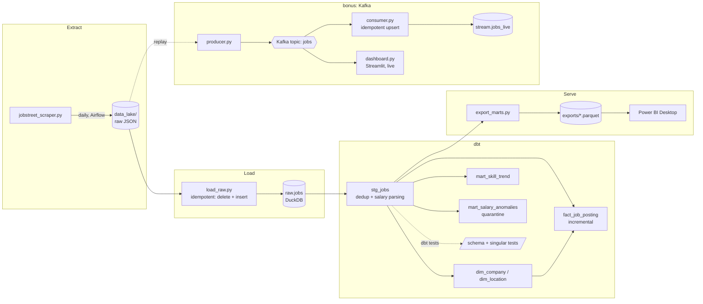

# JobStreet Data Engineering Pipeline

A daily ELT pipeline that scrapes Indonesian data-engineering job postings, models them
into a tested star schema, streams them through Kafka, and serves them to a Power BI
dashboard — built as a hands-on tour through the core data engineering stack.
**Everything runs locally and free:** DuckDB is the warehouse, Docker is the "cloud."

## Architecture



Orchestration: one Airflow DAG runs `scrape → load_raw → build_marts (dbt build) → export_marts`
daily, with retries and `max_active_runs=1` so no two runs ever touch the warehouse at once.

## What this demonstrates

- **Orchestration** — Airflow DAG with retries, idempotent tasks, and a schedule
- **ELT layering** — raw → staging → marts, the dbt convention
- **Data modeling** — star schema with stable (hash-based, not row-number) surrogate keys
- **Incremental models** — `fact_job_posting` only processes new scrape dates
- **Data quality as code** — 20 dbt tests (schema + source + singular), a pipeline that
  fails loudly on bad data instead of silently polluting the mart
- **Deduplication** — pagination-overlap duplicates caught by a grain-uniqueness test,
  fixed with `row_number()` partitioning
- **Data quarantine** — malformed salaries are split into `mart_salary_anomalies`
  instead of dropped; raw data is never mutated or deleted
- **Streaming + idempotency** — a Kafka producer/consumer pair, proven by experience
  (not just told) that at-least-once delivery produces duplicates unless the consumer
  upserts on a primary key
- **Serving layer** — DuckDB's single-writer constraint means BI tools can't query it
  directly without risking a lock collision with the pipeline; marts are exported to
  Parquet instead

## Repo layout

```
jobstreet_scraper.py       the scraper
pipeline/
  load_raw.py               JSON -> raw.jobs (idempotent: delete + insert per date)
  export_marts.py           dbt marts -> exports/*.parquet (read-only, never fights dbt's write lock)
transform/                  dbt project (staging -> marts, tests, seeds)
airflow/                    the DAG + its docker-compose stack
streaming/                  Kafka producer, idempotent consumer, live Streamlit dashboard
powerBI/                    the .pbix dashboard file
ci/sample_jobs.json         a small synthetic fixture GitHub Actions runs dbt against
de_build_plan.md            the full stage-by-stage build log, including bugs hit and fixed
```

## Quickstart

Requires Docker Desktop and Python 3.11+.

```bash
python -m venv .venv
.venv\Scripts\activate          # .venv/bin/activate on macOS/Linux
pip install -r requirements.txt

# Airflow + Kafka in one command (root docker-compose.yml includes both stacks)
docker compose up -d

# first run only: dbt needs at least one scrape in the warehouse
python jobstreet_scraper.py --keywords "data engineer" --where "Indonesia" \
    --out-prefix data_lake/raw/jobstreet/date=2026-01-01/jobs
python pipeline/load_raw.py 2026-01-01
cd transform && dbt build
```

Airflow UI: `localhost:8080` (trigger `jobstreet_pipeline` to run the whole thing daily
from here on). Kafka broker: `localhost:9092`. Live dashboard:
`streamlit run streaming/dashboard.py`, then run `streaming/producer.py` and
`streaming/consumer.py` to see it fill in real time. Power BI: open
`powerBI/jobstreet_dashboard.pbix` and hit Refresh once `exports/*.parquet` exists.

## Honest limitations

- **The trend is short.** Daily scrapes started 2026-06-28; a handful of weeks isn't
  enough to call anything a real trend yet. The chart is correct, the sample size isn't there.
- **The streaming layer replays a file, it doesn't watch a live feed.** `producer.py`
  replays one day's already-scraped JSON. The Streamlit dashboard polls Kafka every
  second and *looks* live, but the underlying data is still daily-batch — a dashboard
  is only as fresh as its slowest upstream step, and here that's the once-a-day scrape.
- **Skill-demand % is a lower bound**, not the true rate: it's computed from title +
  teaser + bullet points (no full job description), and the denominator includes every
  scraped job, not just DE-relevant ones. Rankings between skills are valid; the
  absolute percentages are deflated.

See [`de_build_plan.md`](de_build_plan.md) for the full stage-by-stage log — every bug
hit, why it happened, and how it was fixed.
